# Data Analytics Power BI Report

**Scenario and task given:**
 
*You have recently been approached by a medium-sized international retailer who is keen on elevating their business intelligence practices. With operations spanning across different regions, they've accumulated large amounts of sales from disparate sources over the years.*

*Recognizing the value of this data, they aim to transform it into actionable insights for better decision-making. Your goal is to use Microsoft Power BI to design a comprehensive Quarterly report. This will involve extracting and transforming data from various origins, designing a robust data model rooted in a star-based schema, and then constructing a multi-page report.*

*The report will present a high-level business summary tailored for C-suite executives, and also give insights into their highest value customers segmented by sales region, provide a detailed analysis of top-performing products categorised by type against their sales targets, and a visually appealing map visual that spotlights the performance metrics of their retail outlets across different territories.*
 
 
The work completed for the project is described through 10 Milestones.
 

# Table of  Contents
1. [Milestone 1: Set up the Environment](#milestone-1-set-up-the-environment)
2. [Milestone 2: Import the Date into Power BI](#milestone-2-import-the-data-into-power-bi)
    - [2.1: Load and Transform Orders Table](#21-load-and-transform-orders-table)
    - [2.2: Import and Transform Products Dimension Table](#22-import-and-transform-products-dimension-table)
    - [2.3: Import and Transform the Stores Dimension Table](#23-import-and-transform-the-stores-dimension-table)
    - [2.4: Import and Transform the Customers Table](#24-import-and-transform-the-customers-table)
3. [Milestone 3: Create the Data Model](#milestone-3-create-the-data-model)
    - [3.1: Create a Date Table](#task-31-create-a-date-table)
    - [3.2: Build the Star Schema Data Model](#task-32-build-the-star-schema-data-model)
    - [3.3: Create a Measures Table](#task-33-create-a-measures-table)
    - [3.4: Create Key Measures](#task-34-create-key-measures)
    - [3.5: Create Date and Geography](#task-35-create-date-and-geography)
4. [Milestone 4: Set up the Report](#milestone-4-set-up-the-report)
5. [Milestone 5: Build the Customer Detail Page](#milestone-5-build-the-customer-detail-page)
    - [5.1: Create Headline Card Visuals](#task-51-create-headline-card-visuals)
    - [5.2: Create the Summary Chart](#task-52-create-the-summary-chart)
    - [5.3: Create the Line Chart](#task-53-create-the-line-chart)
    - [5.4: Create the Top 20 Customers Table](#task-54-create-the-top-20-customers-table)
    - [5.5: Create the top Customer Cards](#task-55-create-the-top-customer-cards)
    - [5.6: Add a Date Slicer](#task-56-add-a-date-slicer)
6. [Milestone 6: Create an Executive Summary Page](#milestone-6-create-an-executive-summary-page)
    - [6.1: Create the Card Visuals](#task-61-create-the-card-visuals)
    - [6.2: Add a Revenue Trending Line Chart](#task-62-add-a-revenue-trending-line-chart)
    - [6.3: Add Donut Charts for Revenue by Country and Store Type](#task-63-add-donut-charts-for-revenue-by-country-and-store-type)
    - [6.4: Add a Bar Chart of Orders by Product Category](#task-64-add-a-bar-chart-of-orders-by-product-category)
    - [6.5: Add KPI Visuals](#task-65-add-kpi-visuals)
7. [Milestone 7: Create a Product Detail Page](#milestone-7-create-a-product-detail-page)
    - [7.1: Add Gauge Visuals](#task-71-add-gauge-visuals)
    - [7.2: Plan out the Filter State Cards](#task-72-plan-out-the-filter-state-cards)
    - [7.3: Add an Area Chart of Revenue by Product Category](#task-73-add-an-area-chart-of-revenue-by-product-category)
    - [7.4: Add a Top Products Table](#task-74-add-a-top-products-table)
    - [7.5: Add a Scatter Graph of Quantity Sold vs Profit per Item](#task-75-add-a-scatter-graph-of-quantity-sold-vs-profit-per-item)
    - [7.6: Create a Slicer Toolbar](#task-76-create-a-slicer-toolbar)
8. [Milestone 8: Create a Stores Map Page](#milestone-8-create-a-stores-map-page)
    - [8.1: Add a Map Visual](#task-81-add-a-map-visual)
    - [8.2: Add a Country Slicer](#task-82-add-a-country-slicer)
    - [8.3: Create a Stores Drillthrough Page](#task-83-create-a-stores-drillthrough-page)
    - [8.4: Create a Stores Tooltip Page](#task-84-create-a-stores-tooltip-page)
9. [Milestone 9: Cross-filtering and Navigation](#milestone-9-cross-filtering-and-navigation)
    - [9.1: Fix the Cross-filtering](#task-91-fix-the-cross-filtering)
    - [9.2: Finish the Navigation Bar](#task-92-finish-the-navigation-bar)

## Milestone 1: Set up the Environment

A new GitHub repository is created where the the Power BI project and any other associated files will be stored. Then the connection between GitHub and local repository was establish for easy edit and transfer of files. 

## Milestone 2: Import the Data into Power BI

The dataset gathered by the international retailer consists of four tables: an **Orders** fact table and dimension tables for **Products**, **Stores** and **Customers**.
 

### 2.1: Load and Transform Orders Table

The **Orders** table contains information about each order including the order and shipping dates, the customer, store and product IDs for associating with dimension tables, and the amount of each product ordered. Each order in this table consists of an order of a single product type, so there is only one product code per order.
 
 
To get access to the *Orders* table we press **Get data** on the main ribbon of Power BI programme, choosing **Azure SQL Database** and then connecting with Azure SQL Database using the given credentials such as server name, database name, username and password. Once the connection was established, the *Orders* table was downloaded by pressing **Import** option. 
 
Then the table was edited via *Power Query Editor*:
 - *[Card Number]* column was deleted for data privacy reasons.
 - Using the **Split Column** feature, columns *[Order Date]* and *[Shipping Date]*, containing both date and time, were split into two separate columns each in order to contain date and time values separately. The new columns are called *[Order Date]*, *[Order Time]*, *[Shipping Date]*, *[Shipping Time]*. 
 - Via **Column Quality** view option it was observed that *[Order Date]* column has a small amount of missing/null values. As a result, the rows containing those values were removed to maintain data integrity.
 - All columns' names were checked and renamed (if needed) to align with Power BI naming conventions. This ensures the clarity and consistency of the report. </ul>

### 2.2: Import and Transform Products Dimension Table

The **Products** table contains information about each product sold by the company, including the product code, name, category, cost price, sale price, and weight.
 
 
The *Products* table was downloaded from the given online link as a .csv file and then imported into Power BI by pressing **Get Data** on the main ribbon and then choosing **Text/CSV** option. In the **Data** view, the **Remove Duplicates** function was used on the *[Product Code]* column to ensure each product code is unique. Finally the column names were altered to align with the Power BI naming conventions. 

### 2.3: Import and Transform the Stores Dimension Table

The **Stores** table contains information about each store, including the store code, store type, country, region, and address.
 
 
The *Stores* table was imported by connecting with Azure Blob Storage (using the given credentials such as account name, account key and container name) via **Get data** option and then pressing *Import* to download the data. Once again, the column names were altered to align with the Power BI naming conventions. 

### 2.4: Import and Transform the Customers Table

The **Customers** table contains information about each customer, including their full name, date of birth, company they represent, email, address, country and telephone. 
 
 
The *Customers* table was downloaded from a given online link as a .zip file which then was unzipped within the local machine. Inside the zip file, a folder with three .csv files was located which contains data about three customer groups (customers from United Kingdom, Germany and United States). This data was imported into the Power BI via **Folder data connector** (using **Get data** option) and then by selecting **Combine and Transform** the three .csv files were merged into one query. Once the data from three customer groups was successfully appended, the *[Full Name]* column was created by merging *[First Name]* and *[Last Name]* columns together in *Power Query Editor*. Finally, any unnecessary columns were deleted (in this case only *[Source.Name]* column) and column names were altered to align with the Power BI naming conventions.

## Milestone 3: Create the Data Model

In order to construct a Data Model, first of all, a comprehensive **Date** table is built to act as a basis for time intelligence in the Data Model. Secondly, the relationships between key tables are established to build a **Star-based Schema** with one to many relationships and a single filter direction. Thirdly, a **Measures** table (with key measures in it) is created to support the analysis, encompassing metrics like total orders, revenue, and quarter-based performance indicators. Finally, **Date** and **Geographical Hierarchies** are created to drill down into the data and perform granular analysis within the report. 

### Task 3.1: Create a Date Table

To make use of Power BI's time intelligence functions, a continuous date table was created covering the period from the earliest date in the *orders[Order Date]* column (1st of January 2010) to the latest date in the *orders[Shipping Date]* column (28th of June 2023). To do that, a DAX formula of **dates = CALENDAR(DATE(2010,1,1), DATE(2023,6,28))** was used.
 
 
Then using the just created *dates[Date]* column, additional columns were derived from it with DAX formulas disclosed:

 - *[Day of Week]*:&emsp;&emsp;&ensp;&ensp;&ensp;**Day of Week = FORMAT(dates[Date], "dddd")**
 - *[Month Name]*: &emsp;&emsp;&emsp;**Month Name = FORMAT(dates[Date], "MMMM")**
 - *[Month Number]*: &emsp;&emsp;**Month Number = MONTH(dates[Date])**
 - *[Quarter]*: &emsp;&emsp;&emsp;&emsp;&emsp;&ensp;**Quarter = QUARTER(dates[Date])**
 - *[Year]*: &emsp;&emsp;&emsp;&emsp;&emsp;&emsp;&emsp;**Year = YEAR(dates[Date])**
 - *[Start of Year]*: &emsp;&emsp;&emsp;&ensp;**Start of Year = STARTOFYEAR(dates[Date])**
 - *[Start of Quarter]*: &emsp;&emsp;**Start of Quarter = STARTOFQUARTER(dates[Date])**
 - *[Start of Month]*: &emsp;&emsp;&ensp;**Start of Month = STARTOFMONTH(dates[Date])**
 - *[Start of Week]*: &emsp;&emsp;&emsp;**Start of Week = dates[Date] - WEEKDAY(dates[Date],2) + 1** </ul>

### Task 3.2: Build the Star Schema Data Model

In this task the following relationships between tables were created via the **Model View** to form a *Star Schema*:

 - *products[Product Code]* to *orders[Product Code]*
 - *stores[Store Code]* to *orders[Store Code]*
 - *customers[User UUID]* to *orders[User ID]* (active relationship)
 - *dates[Date]* to *orders[Shipping Date]* (inactive relationship)</ul>

All the relationships mentioned above are one-to-many with a single filter direction flowing from the dimension table side to the fact table side. In our case tables **orders** is a fact tables while tables **customers**, **products**, **stores** and **dates** are dimension tables. 
  
 
See the image below of the completed *Star Schema*:
 
 

### Task 3.3: Create a Measures Table

Creating a separate table for measures helps us to keep our data model organised and easy to navigate. A measures table called **measures table** was created in the data **Model View** with *Power Query Editor*. 

### Task 3.4: Create Key Measures

See below a list of key measures created in the **measures table** together with the DAX formulas used to create them:

 - *Total Orders*:&ensp;&emsp;&emsp;**Total Orders = COUNT(orders[Product Code])**
 - *Total Revenue*: &ensp;&emsp;**Total Revenue = SUMX(orders, orders[Product Quantity] *  RELATED(products[Sale Price]))**
 - *Total Profit*: &ensp;&ensp;&emsp;&emsp;**Total Profit = SUMX(orders, orders[Product Quantity] * (RELATED(products[Sale Price]) - RELATED(products[Cost Price])))**
 - *Total Customers*:&ensp;&ensp;**Total Customers = DISTINCTCOUNT(orders[User ID])**
 - *Total Quantity*:&ensp;&ensp;&emsp;**Total Quantity = SUM(orders[Product Quantity])**
 - *Profit YTD*: &ensp;&emsp;&emsp;&emsp;**Profit YTD = TOTALYTD([Total Profit], dates[Date])**
 - *Revenue YTD*:&ensp;&emsp;&emsp;**Revenue YTD = TOTALYTD([Total Revenue], dates[Date])** </ul>

### Task 3.5: Create Date and Geography 

Hierarchies allow us to to drill down into our data and perform granular analysis within our report. In this report two hierarchies will be created: *Date Hierarchy* and *Geography Hierarchy*.
 
 
In *dates* table a date hierarchy is created using the following levels:
 - Start of Year
 - Start of Quarter
 - Start of Month
 - Start of Week
 - Date </ul>

Before a geography hierarchy can be creates, several adjustments need to be made in **stores** table. Firstly, a new calculated column named *[Country]* is created based on the *stores[Country Code]* column (via **Add Column from Examples** method). It contains country code and a full country name (for example, GB: United Kingdom or US: United States). Secondly, another calculated column named [Geography] is created based on *stores[Country Region]* and *stores[Country]* (created by duplicating *stores[Country Region]* and *stores[Country]* columns and then merging them together (columns separated by comma and space)). The values in *stores[Geography]* column would be in the format of "Suffolk, GB: United Kingdom" or "Berlin, DE: Germany". The column can prove to be useful as it can make the mapping more accurate. Then *stores[Country]* column is renamed to *stores[Country Code and Name]* and using the examples of this column, a new column called stored[Country] was created which has full name of the each country (for example, United Kingdom or United States). This newly created column will be used in the *Geography Hierarchy*. Finally, the correct data category is assigned to *[World Region]*, *[Country]* and *[Country Region]* columns. *[World Region]* is assigned to category **Continent**, *[Country]* to **Country** and *[Country Region]* to **State or Province**. With all these changes, now we can create a geography hierarchy.
 
 
In **stores** table a geography hierarchy is created using the following levels:
 - Country Region
 - Country
 - World Region </ul>

## Milestone 4: Set Up the Report

In this milestone report pages named **Executive Summary**, **Customer Detail**, **Product Detail** and **Stores Map** were created. A purple pre-defined theme is chosen for the report (in the ribbon under the **View** tab). Finally, a navigation sidebar (a rectangular shape covering a narrow strip on the left side of the page with a contrasting turquoise colour) is added on the **Executive Summary** page. The rectangular shape is then duplicated on each other page. This will be the sidebar that we will use to navigate between pages later in the report build.

## Milestone 5: Build the Customer Detail Page

As the title says, this milestone will concentrate on creating a report page focusing on customer-level analysis. The page will contain visuals such as cards, a line chart, top20 table, donut chart and a slicer. 

### Task 5.1: Create Headline Card Visuals

Firstly two **rounded rectangle shapes** were created and positioned on the left corner of the **Customer Details** page, serving as backgrounds for the card visuals (background colour set to purple). Secondly, a new **card** visual is created for the *Total Customers* measure which is renamed to *Unique Customers* and then placed on one of the rectangle shapes. One of the shapes and the *Unique Customers* card is then grouped together as *Group 1* using **Selection** pane in order to treat those two objects as a single unit. Thirdly, additional measure called *Revenue per Customer* was added to the *measures table* with DAX formula **Revenue per Customer = [Total Revenue] / [Total Customers]**. Finally, a second card visual is created for the just created *Revenue per Customer* measure. This card visual is grouped as well with the remaining rectangle shape as *Group 2*. 
 
 
See below how grouped cards look like in the **Selection** pane:

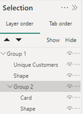

See below for finished headline card visuals:

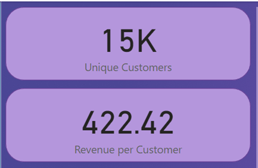

### Task 5.2: Create the Summary Chart

Two summary charts are created to filter *Total Customers* measure by country and product category. Firstly, a **Donut Chart** visual is used to group the customers by the country (filtering *Total Customers* measure by *customer[Country]* column). Then, a **Column Chart** visual is used to group the customers by product category (filtering *Total Customers* measure by *products[Category]*). 

See Donut Chart below:

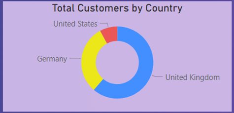

See Column Chart below:

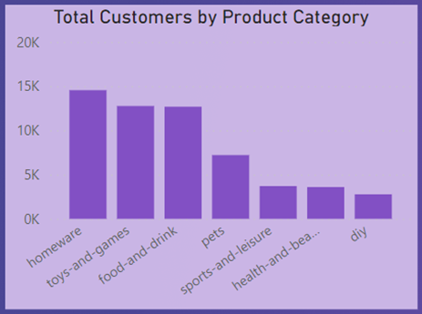

### Task 5.3: Create the Line Chart

A **Line Chart** visual named *Customers Trending* is created on the top right corner of the report page with *Total Customers* measure being on the y-axis and Date Hierarchy on the x-axis. With the Date Hierarchy being present a drill down option is included in the chart where it allows users to drill down the information up to month level (the ability to drill down to week and date levels is excluded). Additionally, a **Trend Line** was included with a **forecast** option for the next 10 periods with a 95% confidence level. Finally, a **Zoom Slider** is included on the x-axis for convenience. 

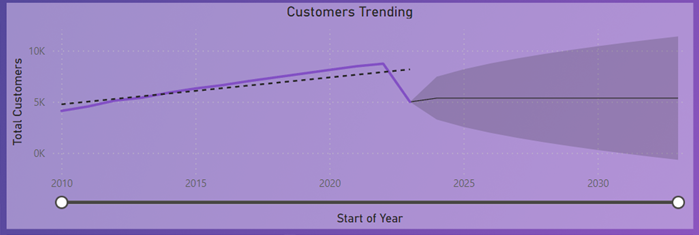

### Task 5.4: Create the Top 20 Customers Table

In this task, we want to display the top 20 customers who contributes most to the revenue of the retailer. A **Table** visual is used to display *customers[Full Name]* column values which is filtered by *Total Revenue* measure using the **TopN filter** type and displaying only top 20 values (these settings can be found in **Filters** pane while adjusting *customers[Full Name]*).

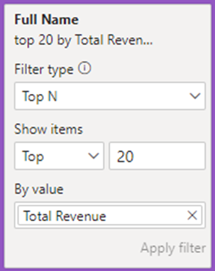

The table also displays *Total Revenue* and *Total Orders* measures. As an additional feature, data bars were added for the revenue values in the table by using **Conditional Formatting**. This is done by right clicking on *Full Name* column in the **Build a visual** pane and then choosing *Conditional  formatting* > *Data bars*. 

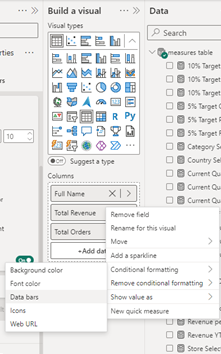

As a result, we have a table that displays top 20 customers with total revenue and total orders generated by them. 

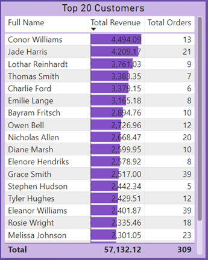

### Task 5.5: Create the Top Customer Cards

For this task, three separate card visuals were used to display three pieces of information about a customer who is contributing most to the retailer's revenue: full name, number of orders placed and total revenue generated by the top customer. In order to display each of this information, additional measures had to be created in order to filter through the data and get the needed top 1 customer's information.
 
These are the measures that were created together with their DAX formulas:
 - *Top Customer by Revenue*: 
  **Top Customer by Revenue = CALCULATE( SELECTEDVALUE( customers[Full Name] ), TOPN( 1, ALL(customers), [Total Revenue], DESC) )**
 - *Number of Orders by Top Customer*: 
  **Number of Orders by Top Customer = CALCULATE( SELECTEDVALUE( orders[Product Quantity] ), TOPN( 1, ALL(orders), [Total Revenue], DESC) )**
 - *Total Revenue by Top Customer*: 
  **Total Revenue by Top Customer = CALCULATE( [Revenue per Customer], TOPN(1, ALL('Customers'), [Revenue per Customer], DESC) )** </ul>
 
With these measures three card visual is created that provides more insights into the top customer. 
 
 
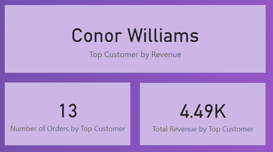

### Task 5.6: Add a Date Slicer

On the final task, a **Date Slicer** was added on the **Customer Detail** report page to allow the user to filter the information on the page by year. The **between** style of slicer was used in order filter between years 2010 and 2023 (the slicer style options were found in **Format** pane > *Visual* > *Slicer settings* > *Options*).

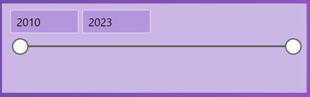

See below how **Customer Detail** report page looks as a whole:

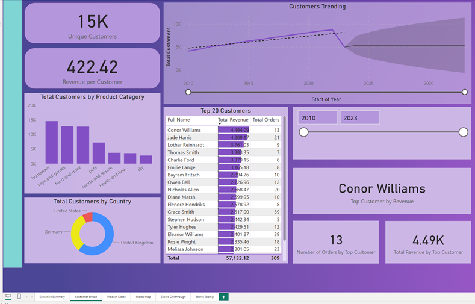

## Milestone 6: Create an Executive Summary Page

In this milestone an **Executive Summary** report page is created where an overview of the company's performance as a whole can be seen. This is useful of executives of the company to get insights and check the outcomes against targets quickly. 
 The report contains the following visuals:
 - Card visuals showing *Total Revenue*, *Total Profit* and *Total Orders*.
 - A graph of revenue against time (using Trending Line Chart).
 - Donut charts showing revenue by country and store type.
 - A bar chart of orders by product category.
 - KPIs for quarterly revenue, profit and orders. </ul>

### Task 6.1: Create the Card Visuals

The aim of the task is to create three card visuals showing **Total Revenue**, **Total Profit** and **Total Orders** measures. 
 
 
This is done by copying Group 1 items (card and shape) from **Customer Detail** report page and pasting it in **Executive Summary** report page three times. This creates three groups of card & shape visuals who are then assigned with *Total Revenue*, *Total Profit* and *Total Orders* measures (from the *measures* table). The card visuals are then formatted so that total revenue and profit cards shown values that are up to two decimal places and total orders card value up to one decimal value (using the settings in **Format** pane > *Callout Value*).

### Task 6.2: Add a Revenue Trending Line Chart

As with the previous task, a trending line chart is copied from **Customer Detail** report page and pasted into **Executive Summary** report page for quickness. In the **Build a Visual** pane x-axis is set to Date Hierarchy which displays only the *Start of Year*, *Start of Quarter* and *Start of Month* while y-axis is set to *Total Revenue* measure. A **Zoom slider** is added (the option of Zoom Slider was turned on in the **Format** pane > *Zoom slider*) on the x-axis so that the user could adjust the timeline as needed.
 
 
By having date hierarchy, the revenue trending line chart can be observed through three levels of hierarchy: Start of Year, Start of Quarter and Start of Month.

<ins>Start of Year</ins>:
 
.png)

<ins>Start of Quarter</ins>:

.png)

<ins>Start of Month</ins>:

.png)

### Task 6.3: Add Donut Charts for Revenue by Country and Store Type

Two donut charts are created to visualise the total revenue by country and store type. 
 
To visualise the revenue by country, the **Legend** option (in **Build a visual** pane) was set as *stores[Country Code]* column and the **Values** option was set as *Total Revenue* measure. To visualise the revenue by store type, the **Legend** was set as *stores[Store Type]* column and the **Values** was set as *Total Revenue* measure. In order to make the donut charts more compact and clear in our report page, the *Legend* option in **Format** pane is turned off and the *label contents* is set to **Category** (found in **Format** pane > *Detail labels* > *Options*).

### Task 6.4: Add a Bar Chart of Orders by Product Category

Once again for quickness, a bar chart from **Customer Detail** report page is copied and then pasted into **Executive Summary** report page. In the on-object **Build a visual** pane, the visual type is changed to *Clustered bar chart* as well as x-axis is changed from *Total Customers* to *Total Orders* measure (*Category* measure on y-axis is left the same). Finally, from the on-object **Format** pane, **Data Labels** option is turned on. 

### Task 6.5: Add KPI visuals

Before even creating KPI or a.k.a Key Performance Indicator visuals, a set of new measures are created which are then used in the KPI visuals (see DAX formulas below):
 - *Previous Quarter Profit*: &emsp;&emsp;&emsp;**Previous Quarter Profit = CALCULATE([Total Profit], PREVIOUSQUARTER(dates[Date]))**
 - *Previous Quarter Revenue*: &ensp;&emsp;**Previous Quarter Revenue = CALCULATE([Total Revenue], PREVIOUSQUARTER(dates[Date]))**
 - *Previous Quarter Orders*:&ensp;&ensp;&emsp;&ensp;**Previous Quarter Orders = CALCULATE([Total Orders], PREVIOUSQUARTER(dates[Date]))**
 - *Target Profit*: &ensp;&ensp;&ensp;&ensp;&ensp;&ensp;&ensp;&emsp;&emsp;&emsp;&emsp;**Target Profit = [Previous Quarter Profit] * 1.05**
 - *Target Revenue*:&ensp;&ensp;&ensp;&emsp;&emsp;&emsp;&emsp;&emsp;**Target Revenue = [Previous Quarter Revenue] * 1.05**
 - *Target Orders*: &emsp;&emsp;&emsp;&emsp;&emsp;&emsp;&emsp;**Target Orders = [Previous Quarter Orders] * 1.05**</ul>
 
A new KPI visual is created for the revenue. In the on-object **Build a visual** pane, **Value** is set as *Total Revenue* measure, **Trend axis** as *dates[Start of Quarter]* column and **Target** as *Target Revenue* measure. In the **Format** pane, *Trend of axis* is turned on, the values are set so that **Direction** is set to *High is Good*, **Bad colour** is set to red colour and **Transparency** is set to 15%. Then the *Callout value* option in the **Format** pane is set to show the KPI value up to 1 decimal place. This creates a KPI for revenue visual that shows the quarterly revenue against the target quarterly revenue. 
 
 
The KPI for revenue visual is then duplicated twice and adjusted in order to display KPI visuals for quarterly profit and orders.
 
 

 
 
The completed **Executive Summary** report page can be seen below:
 

## Milestone 7: Create a Product Detail Page

*Scenario: The product team at the company have asked you to create a product detail page for the project. The purpose of this page is provide an in-depth look at which products within the inventory are performing well, with the option to filter by product and region.*
 
  The report page will contain:
 - Set of three gauge visuals showing the current-quarter performance of Orders, Revenue and Profit against a quarterly target.
 - Card visuals that shows which filters are selected.
 - An area chart showing relative revenue performance of each category over time. 
 - A table showing top 10 of products by revenue.
 - A scatter graph of quantity ordered against profit per order item, filtered by product category. </ul>

### Task 7.1: Add Gauge Visuals

In order to create a set of three gauges showing the current-quarter performance of **Orders**, **Revenue** and **Profit** against a quarterly target (which in this case is 10% quarter-on-quarter growth in all three metrics), six DAX measures are created:
 - *Current Quarter Orders*: &emsp;&emsp;&emsp;&emsp;**Current Quarter Orders = CALCULATE([Total Orders], QUARTER(dates[Date]))**
 - *Current Quarter Revenue*:&ensp;&ensp;&ensp;&emsp;&emsp;**Current Quarter Revenue = CALCULATE([Total Revenue], QUARTER(dates[Date]))**
 - *Current Quarter Profit*: &ensp;&emsp;&emsp;&emsp;&emsp;**Current Quarter Profit = CALCULATE([Total Profit], QUARTER(dates[Date]))**
 - *10% Target Orders*: &emsp;&emsp;&emsp;&emsp;&emsp;&emsp;**10% Target Orders = [Current Quarter Orders] * 1.10**
 - *10% Target Revenue*:&ensp;&ensp;&ensp;&emsp;&emsp;&emsp;&emsp;**10% Target Revenue = [Current Quarter Revenue] * 1.10**
 - *10% Target Profit*:&ensp;&ensp;&emsp;&emsp;&emsp;&emsp;&emsp;&emsp;**10% Target Profit = [Current Quarter Profit] * 1.10** </ul>

For each gauge, in the **Build a visual** pane, the maximum value is set as the target (so that each gauge shows as full when the target is met), meaning *10% Target Orders/10% Target Revenue/10% Target Profit* measures are added to the **Maximum Value** section while *Current Quarter Orders/Current Quarter Revenue/Current Quarter Profit* measures are added to the **Value** section.
 
 
Afterwards, *Conditional Formatting* is applied to the **Callout Value** (the number in the middle of each gauge) so that it shows as red if the target is not yet met. This is done by creating rules via the **Format** pane> *Callout Value* > *Values: Colours*.

See the finished gauge visuals below:

### Task 7.2: Plan Out the Filter State Cards

Two rectangular shapes and two cards are created in the left corner of the **Product Detail** report page. Each shape is grouped up in the **Selection** pane with a card which forms two groups (Group 1 and Group 2) while in both groups having the card visual being at the top of the list. 
 
 

 
 
In each card's settings (located at the **Format** pane) the background is turned off in order for the shapes to represent the background of the cards. 
 
 
Before adding any values to the cards, two new measures are created:
 - *Category Selection*:  **IF(ISFILTERED(Products[Category]), SELECTEDVALUE((Products[Category]), "No Selection"),"No Selection")**
 - *Country Selection*:  **Country Selection = IF(ISFILTERED(Stores[Country]), SELECTEDVALUE((Stores[Country]), "No Selection"),"No Selection")** </ul>

These two measures are then added to each of the blank cards. This allows each of the cards to portray the name of the category or country when selected by the user. However if nothing is selected by the user, the cards will simply show "No Selection" sign. 
 
 

### Task 7.3: Add an Area Chart of Revenue by Product Category

For this task an area chart is created in order to show how different product categories are performing in terms of revenue over time. In the new chart, the *dates[Start of the Quarter]* column values are added on the **X-axis** with the ability for the user to drill down the information from *Start of Quarter* up to the *Day*, *Total Revenue* measure added on the **Y-axis** and *products[Category]* columns values are added to the **Legend**.

See the completed area chart visual below for different date hierarchy levels:

<ins>Start of Year</ins>:

.png)

<ins>Start of Quarter</ins>:

.png)

<ins>Start of Month</ins>:

.png)

<ins>Start of Day</ins>:

.png)

### Task 7.4: Add a Top Products Table

In order to see which products generate most revenue, a table is created to portray the top 10 products by total revenue. 
 
 
The table contains the following fields:
 - *products[Description]* column values, renamed for the visual as "Top 10 Products".
 - *products[Category]* column values
 - *Total Revenue* measure, which has **TopN filter** applied to show top 10 items as well as conditional formatting applied to show data bars for total revenue values.
 - *Total Customers* measure
 - *Total Orders* measure
 - *Profit per Order* measure </ul>
 

### Task 7.5: Add a Scatter Graph of Quantity Sold vs Profit per Item

Scenario: *The products team want to know which items to suggest to the marketing team for a promotional campaign. They want a visual that allows them to quickly see which product ranges are both top-selling items and also profitable.* To complete this task a scatter graph is chosen for illustration purposes. 
 
 
Firstly, a calculated column called *Profit per Item* was created in the *products* table using the DAX formula: 
 **Profit per Item = products[Sale Price] - products[Cost Price]**
 
 
Then the newly added Scatter graph is configured in a way below:
 - **Values**: *products[Description]*
 - **X-axis**: *products[Profit per Item]*
 - **Y-axis**: *orders[Total Quantity]*
 - **Legend**: *products[Category]* </ul>
 

### Task 7.6: Create a Slicer Toolbar

The aim of this task is to create a pop-out toolbar containing two slicers which can be accessed from the navigation bar on the left-hand side of the report page. 
 
 
To start with, a set of custom navigation bar icons were downloaded from a given link. Then a new blank button was added to the top of the navigation bar, the icon type is set to *Custom* in the **Format** pane, and Filter_icon.png icon image was chosen for the button. Also the *tooltip text* was set to "Open Slicer Panel".

 

Then a new rectangle shape (with same height as the report page and 3-5x the width of the navigation bar) in the same turquoise colour as the navigation bar was added. On the **Selection** pane, the newly created shape is brought to the top of the stacking order. This will be our slicer toolbar shape.

Afterwards, two new slicers are created. One for product's category selection (*products[Category]* is added to the **Field** section) and one for selection of a country (*stores[Country]* is added to the **Field** section). The titles for the slicers are changed to "Product Category" and "Country" respectively. The slicers are edited in a way that both would be in **Vertical List** slicer style (**Format** pane > *Slicer settings* > *Options*), user can select multiple items in *Product Category* slicer, but only one option at the time for *Country* slicer and adding **Select All** option (**Format** pane > *Slicer settings* > *Selection*) to **Country** slicer so that the user can select all the countries if they do not wish to filter the data by country. Both slicers are then placed on top of the slicer toolbar shape with background colour removed (so that the slicer toolbar shape colour would fill the slicers).

A back button is added (**Insert** on the ribbon > *Buttons* > *Back*) on top corner of the slicer toolbar shape. This button will allow us to hide the slicer toolbar when it is not in use. 

Now in the **Selection** pane, we group the slicer toolbar shape, two slicers and a back button into one group (Group 3) and once again we make sure it is at the top of the stacking order. 

See the complete slicer toolbar below:

To add bookmarks, we need to open **Bookmarks** pane and add two bookmarks: one called "Slicer Bar Closed" and the other one called "Slicer Bar Open". The idea is that the "Slicer Bar Closed" bookmark will make the slicer bar hidden while the "Slicer Bar Open" bookmark will make the slicer bar visible. When right-clicking each bookmark, it is set so that **Display**, **Current Page** and **All visuals** options are all ticked while the rest of the categories are unchecked (it is essential not to leave **Data** option ticked as this will prevent the bookmark from altering the slicer state when we open or close the slicer toolbar). 

Finally, we assign actions to our "Open Slicer Panel" and "Back" buttons. We can do that by individually selecting each button and then in **Format button** pane turning the **Action** option on. For the "Back" button we select **Action type** as "Bookmark" and **Action Bookmark** as "Slicer Bar Closed" while for the "Open Slicer Panel" button we select **Action type** as "Bookmark" and **Action Bookmark** as "Slicer Bar Closed.

 

Now we can test the buttons and slicers work (to test the buttons we need to use Ctrl-Click while designing the report in Power BI Desktop).

See the complete **Product Detail** report page below:

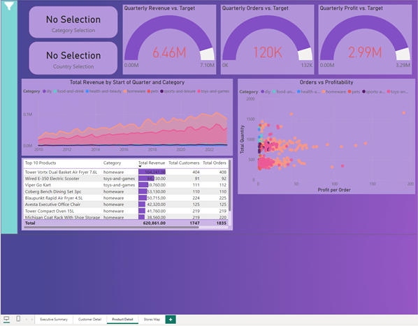

## Milestone 8: Create a Stores Map Page

Scenario: *The regional managers have requested a report page that allows them to easily check on the stores under their control, allowing them to see which of the stores they are responsible are most profitable, as well as which are on track to reach their quarterly profit and revenue targets. After reviewing the brief, you decide that the best way to handle this is using a map visual.*
 

### Task 8.1: Add a Map Visual

On the **Stores Map** page, a new map visual is added with **Location** set as *Geographic Hierarchy* and **Bubble size** set as *Profit YTD* measure. By adding *Geographic Hierarchy* to the map visual we allow the user to filter the information about the stores by country region, country and world region. 
 
 
The controls of the map visual are as follows:
 - **Show Labels** function in the **Format** pane > Map Settings > Style is turned On. 
 - **Auto Zoom** function in the **Format** pane > Map Settings > Controls is turned On while **Zoom Buttons** and **Lasso button** is turned Off. </ul>

<ins>By Country Region</ins>:
 
.png)

<ins>By Country</ins>:
 
.png)

<ins>By World Region</ins>:
 
.png)

### Task 8.2: Add a Country Slicer

A **Tile** slicer is added above the map visual with *stores[Country]* column values set to the **Field** section. This allows the user to filter the map visual by country (selecting to see information about the stores from United Kingdom, United States or Germany).
 
 
The controls of the slicer are as follows:
 - **Multi-select with Ctrl/Cmd** function in the **Format** pane section > Slicer Settings > Selection is turned On.
 - **Show "Select All" as an option in the slicer** function in the **Format** pane section > Slicer Settings > Selection is turned On. </ul>

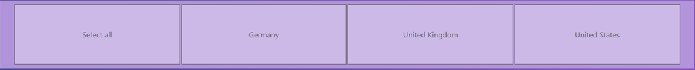

### Task 8.3: Create a Stores Drillthrough Page

The purpose of a drillthrough page is to summarise each store's performance which will make it easy for the region managers to check on the progress of any given store. 
 
 
Once the new report page is created and named **Stores Drillthrough**, it's page settings (via **Format** pane) are adjusted so that the **Page Type** (in **Page Information** section) is set to *Drillthrough*, **Drillthrough from** is set to *stores[Country Region]* column values and **Drillthrough when** is set to *Country Region is Used as Category*.
 
 
Once the page is set up, four types of visuals are added to the page:
 - A table showing top 5 products based on total revenue.
 - A clustered column chart showing total orders by product category.
 - Two gauges, showing profit year to date against profit goal and then revenue year to date against revenue goal. 
 - A card visual that shows the name of the selected store (selecting one of the country regions).

Firstly, a table is created with columns: *products[Description]* (which is renamed to "Top 5 Products"), *Profit YTD* measure, *Total Orders* measure and *Total Revenue* measure. Through **Filters** pane, *Top 5 Products* column has **Filter Type** set as *TopN*, **Shown Items** as *Top 5* and **By value** as *Total Revenue* measure. As a final touch, *Total Revenue* column in the table is edited through conditional formatting to include data bars.This allows the region managers to see the top 5 products by revenue of any store.

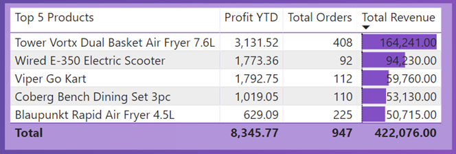

Secondly, a clustered column chart visual is created with *products[Category]* values being set on **X-axis** and *Total Orders* measure being set on **Y-axis**. This shows which product category generates most orders for any chosen store. 

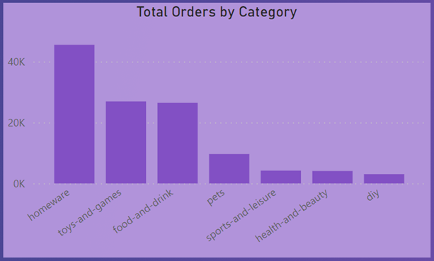

Thirdly, a couple of new measures are created which later are used in gauge visuals:
 - *Profit Goal*:&ensp;&ensp;&ensp;&ensp;&emsp;**Profit Goal = (CALCULATE([Profit YTD], SAMEPERIODLASTYEAR(dates[Date])) * 1.20)**
 - *Revenue Goal*:&ensp;&ensp;&ensp;**Revenue Goal = (CALCULATE([Revenue YTD], SAMEPERIODLASTYEAR(dates[Date])) * 1.20)** </ul>

The goals are made by adding 20% increase on the previous year's Profit YTD and Revenue YTD.
 
 
Two gauge visuals are then created using *Profit YTD* and *Profit Goal* measures to show profit year-to-date of any given store against the target and using *Revenue YTD* and *Revenue Goal* measures to show revenue year-to-date of any given store against the target. 

Finally, in order to create a selection card visual to show the name of the store selected, a new measure is created: 
  **Store Selection = IF(ISFILTERED(stores[Country Region]), SELECTEDVALUE((stores[Country Region]), "No Selection"),"No Selection")**
 
This new measure is then used in the **Field** section of the card visual. 

See below the completed Store Drillthrough page:

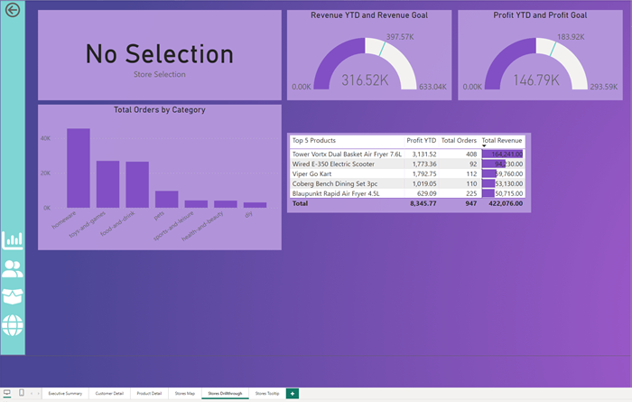

### Task 8.4: Create a Stores Tooltip Page

In order to provide the store map an extra feature where users would be able to see each store's year-to-date profit against the profit target just by hovering the mouse over a store on the map, a new tooltip page named **Stores Tooltip** is created. In the **Format** pane > Page Information > Page Type is selected as *Tooltip* which then significantly reduces the dimensions of the page (the dimensions of a tooltip are provided). From the **Stores Drillthrough** page, the Profit YTD vs Profit Goal gauge visual is copied and pasted into the **Stores Tooltip** page. 

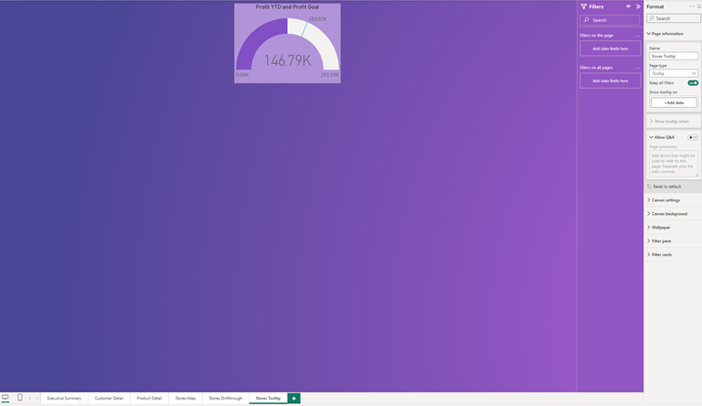

See below the gauge tooltip in action when using the store's map as well as the completed version of **Stores Map** page:

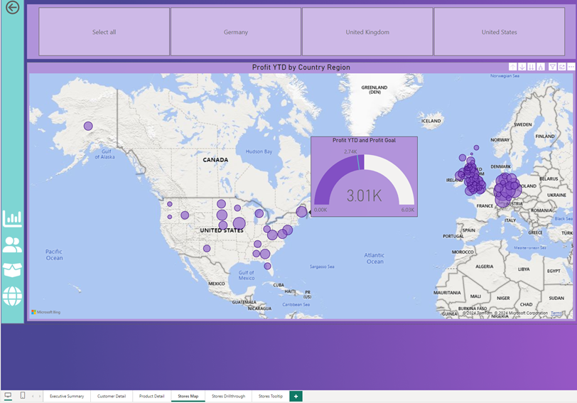

## Milestone 9: Cross-Filtering and Navigation

### Task 9.1: Fix the cross-filtering

Power BI has cross-highlighting set up by default on most visuals, which means clicking on a region in one visual will automatically filter the others. However, we may not want this function to be applied for all our visuals as it may misrepresent the intend of some visuals. 

1. <ins>Executive Summary Page</ins>
 
 
The *Orders by Category bar chart* showing the total orders by product category should not filter the card visuals or KPIs. This is because the filtering of card visuals and KPIs by product category would not give the user much insight. This can be done by clicking on the actual bar chart and then on the main ribbon **Format** tab, we need to click **Edit Interactions**. This allows us to choose the visuals that we want not to be filtered by the bar chart (see the printscreen below)

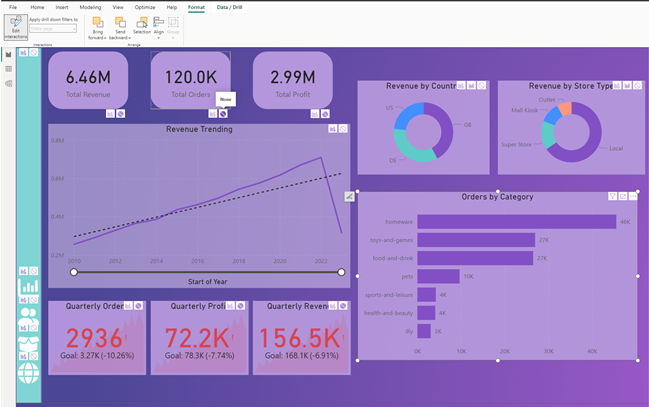

The sign below means the visual will not be filtered by the bar chart:

While this sign below means the visual will be filtered by the bar chart:

2. <ins>Customer Detail Page</ins>
 
 
The visual interactions are changed so that *Top 20 Customers table* would not filter any other visuals on the page, *Total Customers by Product Category clustered column chart* would not filter *Customers Trending Line Chart*.

3. <ins>Product Detail Page</ins>
 
 
The visual interactions are changed so that *Orders vs Profitability Scatter Chart* and *Top 10 Products table* would not filter any other visuals. 

### Task 9.2: Finish the Navigation Bar

As the final touch for our navigation bar, the four custom icons (which we downloaded earlier) are added to the navigation bar which would allow the users to easily move between pages. Each custom icon represent the each of the four report pages: **Executive Summary**, **Customer Detail**, **Product Detail** and **Stores Map**. 
 
 
For each icon there are two colour variants. The white version is used for the default button appearance while the black version is used to show the button changing colour when hovered over with the mouse pointer. However as the downloaded icons only have white and cyan versions (the cyan version icons in our report case cannot be used as the colour matches the navigation bar and therefore the icons would be lost when hovered over with the mouse pointer), the cyan icons are recoloured into black via this [website](https://onlinepngtools.com/change-png-color).

Executive Summary page icon:

 &emsp;&emsp; 

Customer Detail page icon:

 &emsp;&emsp; 

Product Detail page icon:

 &emsp;&emsp; 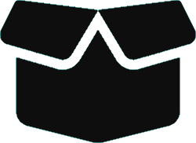

Stores Map page icon:

 &emsp;&emsp; 

In the sidebar of the **Executive Summary** page, four new blank buttons are added, and in the **Format Button** pane > Button > Button Style, the **Apply settings to** field is set to *Default*, and then each button icon is set to the relevant white png in the **Format Button** pane > Button Style > Icon > Icon Type field.
 
 
In order for each button icon to change from white to black when hovered over with the mouse pointer, we go to **Format button** pane > Button Style > Apply settings to and set it to *On Hover*, and then select the black icon png under the **Icon tab**. 
 
 
Then for each button in **Format button** pane > Action, we turn the Action On, assign the **Type** to *Page Navigation* and then select the correct page name under **Destination**. 
 
 
As an extra feature, we can make our buttons clearer by going to **Format button** pane > Tooltip, turning the Tooltip On and under the **Text** write the name of each report page. This will provide a pop up text of report page name when user hovers over the button with the mouse pointer (see the example image below):

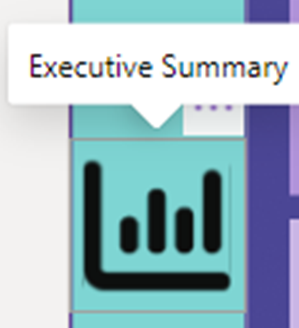

Once the setup for the four buttons on the **Executive Summary** page are finished, they are copied and pasted on other report pages. 
 
 
Let us not forget to also add the back button for each page.

See below for the completed navigation bar (example taken from **Product Detail** report page):

After re-arranging and adjusting some visuals in each report page, see the completed report pages below:
 
 
<ins>Executive Summary page:</ins>
 
 
.png)
 
 
<ins>Customer Detail page:</ins>
 
 
.png)
 
 
<ins>Product Detail page:</ins>
 
 
.png)
 
 
<ins>Stores Map page:</ins>
 
 
.png)