# Data Analytics Power BI Report

**Scenario and task given:**
 
*You have recently been approached by a medium-sized international retailer who is keen on elevating their business intelligence practices. With operations spanning across different regions, they've accumulated large amounts of sales from disparate sources over the years.*

*Recognizing the value of this data, they aim to transform it into actionable insights for better decision-making. Your goal is to use Microsoft Power BI to design a comprehensive Quarterly report. This will involve extracting and transforming data from various origins, designing a robust data model rooted in a star-based schema, and then constructing a multi-page report.*

*The report will present a high-level business summary tailored for C-suite executives, and also give insights into their highest value customers segmented by sales region, provide a detailed analysis of top-performing products categorised by type against their sales targets, and a visually appealing map visual that spotlights the performance metrics of their retail outlets across different territories.*
 
 
The work in the project is described through **10 Milestones**.
 
## Milestone 1: Set up the Environment

A new GitHub repository was created where the the Power Bi project and any other associated documents will be stored. Then the connection between GitHub and local repository was establish for easy edit and transfer of files. 

## Milestone 2: Import the Data into Power BI

The data from the retailer was divided into four tables: **Orders**, **Products**, **Stores** and **Customers**.
 

### 2.1: Load and Transform Orders Table

The **Orders** table contains information about each order including the order and shipping dates, the customer, store and product IDs for associating with dimension tables, and the amount of each product ordered. Each order in this table consists of an order of a single product type, so there is only one product code per order.
 
 
The *Orders* table was imported by connecting with Azure SQL Database (using the given credentials such as server name, database name, username and password) and then using the *Import* option in Power BI. 
 
Then the table was edited via *Power Query Editor*:
 - [Card Number] column was deleted for data privacy reasons.
 - Using the *Split Column* feature, columns [Order Date] and [Shipping Date], containing both date and time, were split into two separate columns each in order to contain date and time values separately. The new columns are called [Order Date], [Order Time], [Shipping Date], [Shipping Time]. 
 - Via *Column Quality* view option it was observed that [Order Date] column has a small amount missing/null values. As a result, the rows containing those values were removed to maintain data integrity
 - All columns' names were checked and renamed (if needed) to align with Power BI naming conventions. This ensures the clarity and consistency of the report. </ul>

### 2.2: Import and Transform Products Dimension Table

The **Products** table contains information about each product sold by the company, including the product code, name, category, cost price, sale price, and weight.
 
 
The *Products* table was downloaded from the given online link as a .csv file and then imported into Power BI. In the *Data* view, the *Remove Duplicates* function was used on the [Product Code] column to ensure each product code is unique. Finally the column names were altered to align with the Power BI naming conventions. 

### 2.3: Import and Transform the Stores Dimension Table

The **Stores** table contains information about each store, including the store code, store type, country, region, and address.
 
 
The *Stores* table was imported by connecting with Azure Blob Storage (using the given credentials such as account name, account key and container name) and using the *Import* option in Power BI. Then the column names were altered to align with the Power BI naming conventions. 

### 2.3: Import and Transform the Customers Table

The **Customers** table contains information about each customer, including their full name, date of birth, company they represent, email, address, country and telephone. 
 
 
The *Customers* table was downloaded from a given online link as a .zip file which then was unzipped within the local machine. Inside the zip file, a folder with three .csv files was located which contains data about three customer groups (customers from United Kingdom, Germany and United States). This data was imported into the Power BI via *Folder* data connector and then by selecting *Combine and Transform* the three .csv files were merged into one query. Once the data from three customer groups was successfully appended the [Full Name] column was created by merging [First Name] and [Last Name] columns together in *Power Query Editor*. Finally, any unnecessary columns were deleted (in this case only [Source.Name] column) and column names were altered to align with the Power BI naming conventions.

## Milestone 3: Create the Data Model

In order to construct a Data Model, first of all, a comprehensive Date table is built to act as a basis for time intelligence in the Data Model. Secondly, the relationships between key tables are established to build a star-based schema with one to many relationships and a single filter direction. Thirdly, a Measures table (with key measures in it) is created to support the analysis, encompassing metrics like total orders, revenue, and quarter-based performance indicators. Finally, Date and Geographical Hierarchies are created to drill down into the data and perform granular analysis within the report. 

### Task 3.1: Create a Date Table

To make use of Power BI's time intelligence functions, a continuous date table was created covering the period from the earliest date in the Orders[Order Date] column (1st of January 2010) to the latest date in the Orders[Shipping Date] column (28th of June 2023). To do that, a DAX formula of **dates = CALENDAR(DATE(2010,1,1), DATE(2023,6,28))** was used.
 
 
Then using the just created dates[Date] column, additional columns were derived from it with DAX formulas disclosed:

 - [Day of Week] column:&emsp;&emsp;&ensp;&ensp;&ensp;**Day of Week = FORMAT(dates[Date], "dddd")**
 - [Month Name] column: &emsp;&emsp;&emsp;**Month Name = FORMAT(dates[Date], "MMMM")**
 - [Month Number] column: &emsp;&emsp;**Month Number = MONTH(dates[Date])**
 - [Quarter] column: &emsp;&emsp;&emsp;&emsp;&emsp;&ensp;**Quarter = QUARTER(dates[Date])**
 - [Year] column: &emsp;&emsp;&emsp;&emsp;&emsp;&emsp;&emsp;**Year = YEAR(dates[Date])**
 - [Start of Year] column: &emsp;&emsp;&emsp;&ensp;**Start of Year = STARTOFYEAR(dates[Date])**
 - [Start of Quarter] column: &emsp;&emsp;**Start of Quarter = STARTOFQUARTER(dates[Date])**
 - [Start of Month] column: &emsp;&emsp;&ensp;**Start of Month = STARTOFMONTH(dates[Date])**
 - [Start of Week] column: &emsp;&emsp;&emsp;**Start of Week = dates[Date] - WEEKDAY(dates[Date],2) + 1** </ul>

### Task 3.2: Build the Star Schema Data Model

In this task the following relationships between tables were created via the *Model View* to form a star schema:

 - products[Product Code] to orders[Product Code]
 - stores[Store Code] to orders[Store Code]
 - customers[User UUID] to orders[User ID] (active relationship)
 - dates[Date] to orders[Shipping Date] (inactive relationship)</ul>

All the relationships mentioned above are one-to-many with a single filter direction flowing from the dimension table side to the fact table side. In our case tables *orders* and *customers* are fact tables while tables *products*, *stores* and *dates* are dimension tables. 
  See the image below of the completed star schema:
 
 
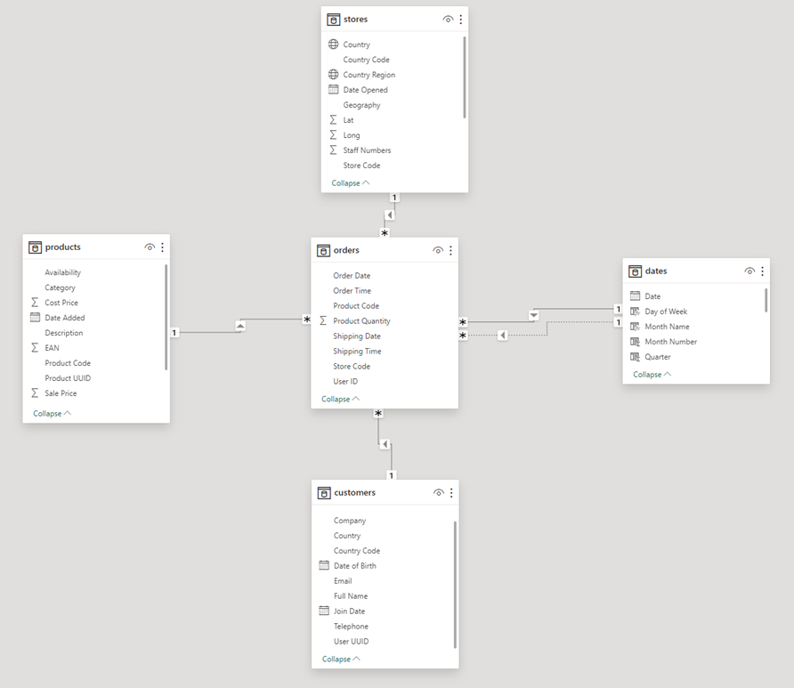

### Task 3.3: Create a Measures Table

Creating a separate table for measures helps us to keep our data model organised and easy to navigate. A measures table called *measures table* was created in the data **Model View* with **Power Query Editor**. 

### Task 3.4: Create Key Measures

See below a list of key measures created in the *measures table* together with the DAX formulas used to create them:

 - Total Orders:&ensp;&emsp;&emsp;**Total Orders = COUNT(orders[Product Code])**
 - Total Revenue: &ensp;&emsp;**Total Revenue = SUMX(orders, orders[Product Quantity] *  RELATED(products[Sale Price]))**
 - Total Profit: &ensp;&ensp;&emsp;&emsp;**Total Profit = SUMX(orders, orders[Product Quantity] * (RELATED(products[Sale Price]) - RELATED(products[Cost Price])))**
 - Total Customers:&ensp;&ensp;**Total Customers = DISTINCTCOUNT(orders[User ID])**
 - Total Quantity:&ensp;&ensp;&emsp;**Total Quantity = SUM(orders[Product Quantity])**
 - Profit YTD: &ensp;&emsp;&emsp;&emsp;**Profit YTD = TOTALYTD([Total Profit], dates[Date])**
 - Revenue YTD:&ensp;&emsp;&emsp;**Revenue YTD = TOTALYTD([Total Revenue], dates[Date])** </ul>

### Task 3.5: Create Date and Geography 

Hierarchies allow us to to drill down into our data and perform granular analysis within our report. In this report two hierarchies will be created: *Date Hierarchy* and *Geography Hierarchy*.
 
 
In *dates* table a date hierarchy is created using the following levels:
 - Start of Year
 - Start of Quarter
 - Start of Month
 - Start of Week
 - Date </ul>

Before a geography hierarchy can be creates, several adjustments need to be made in *stores* table. Firstly, a new calculated column named [Country] is created based on the stores[Country Code] column (via **Add Column from Examples** method). It contains country code and a full country name (for example, GB: United Kingdom or US: United States). Secondly, another calculated column named [Geography] is created based on stores[Country Region] and stores[Country] (created by duplicating stores[Country Region] and stores[Country] columns and then merging them together (columns separated by comma and space)). The values in stores[Geography] column would be in the format of "Suffolk, GB: United Kingdom" or "Berlin, DE: Germany". The column can prove to be useful as it can make the mapping more accurate. Finally, the correct data category is assigned to [World Region], [Country] and [Country Region] columns. [World Region] is assigned to category *Continent*, [Country] to *Country* and [Country Region] to *State or Province*. With all these changes, now we can create a geography hierarchy.
 
 
In *stores* table a geography hierarchy is created using the following levels:
 - World Region
 - Country
 - Country Region </ul>

## Milestone 4: Set Up the Report

In this milestone report pages named **Executive Summary**, **Customer Detail**, **Product Detail** and **Stores Map** were created. A purple pre-defined theme was chosen for the report (in the ribbon under the **View** tab). Finally, a navigation sidebar (a rectangular shape covering a narrow strip on the left side of the page with a contrasting turquoise colour) was added on the *Executive Summary* page. The rectangular shape was duplicated on each other page. This will be the sidebar that we will use to navigate between pages later in the report build.

## Milestone 5: Build the Customer Detail Page

As the title says, this milestone will concentrate on creating a report page focusing on customer-level analysis. The page will contain visuals such as cards, a line chart, top20 table, donut chart and slicer. 

### Task 5.1: Create Headline Card Visuals

Firstly two rectangle shapes were created and positioned on the left corner of the **Customer Details** page, serving as backgrounds for the card visuals (background colour set to purple). Secondly, a new card visual is created for the [Total Customers] measure which is renamed to **Unique Customers** and then placed on one of the rectangle shapes. One of the shapes and the *Unique Customers* card is then grouped together as *Group 1* using **Selection** pane in order to treat those two objects as a single unit. Thirdly, additional measure called *Revenue per Customer* was added to the *measures table* with DAX formula **Revenue per Customer = [Total Revenue] / [Total Customers]**. Finally, a second card visual is created for the just created *Revenue per Customer* measure. This card visual is grouped as well with the remaining rectangle shape as *Group 2*. 

### Task 5.2: Create the Summary Chart

Two summary charts are created to filter *Total Customers* measure by country and product category. Firstly, a Donut Chart visual is used to group the customers by the country (filtering *Total Customers* measure by customer[Country] column). Then, a Column Chart visual is used to group the customers by product category (filtering *Total Customers* measure by products[Category]). 

### Task 5.3: Create the Line Chart

A Line chart visual is created on the top of the report page with *Total Customers* measure being on the y-axis and Date Hierarchy on the x-axis. A drill down option was included in the chart where it allows users to drill down the information up to month level (and therefore skipping week and date levels). Additionally, a trend line line was included with a forecast for the next 10 periods with a 95% confidence level. 

### Task 5.4: Create the Top 20 Customers Table

In this task, we want to display the top 20 customers that contributes most to the revenue of the retailer. A Table visual is used to represent customers[User UUID] column data (this column was chosen in order to display only unique customers by their IDs as the customers[Full Name] column data might contain duplicates) which is filtered by *Total Revenue* measure using the TopN filter type. The table also had *Total Revenue* and *Total Orders* measures added. What is more, by using conditional formatting to the revenue column in the table, data bars were added for the revenue values. As a result, the table displays top 20 customers IDs with revenue and number of orders. 

### Task 5.5: Create the Top Customer Cards

For this task, three separate card visuals were used to display three pieces of information about a customer who is contributing most to the retailer's revenue: Full Name, Number of Orders placed and Total Revenue generated by the top customer. In order to display each of this information, additional measures had to be created in order to filter through the data and get the needed top 1 customer's information.
 
These are the measures that were created together with their DAX formulas:
 - Top Customer by Revenue: 
  **Top Customer by Revenue = CALCULATE( SELECTEDVALUE( customers[Full Name] ), TOPN( 1, ALL(customers), [Total Revenue], DESC) )**
 - Number of Order by Top Customer: 
  **Number of Orders by Top Customer = CALCULATE( SELECTEDVALUE( orders[Product Quantity] ), TOPN( 1, ALL(orders), [Total Revenue], DESC) )**
 - Total Revenue by Top Customer: 
  **Total Revenue by Top Customer = CALCULATE( [Revenue per Customer], TOPN(1, ALL('Customers'), [Revenue per Customer], DESC) )** </ul>
 
With these measures we have a three card visual that provides insights into the top customer by revenue. 

### Task 5.6: Add a Date Slicer

On the final task, a date slicer was added on the **Customer Detail** report page to allow the user to filter the information on the page by year. The **between** style of slicer was used in order filter between 2010 and 2023 years. 

## Milestone 6: Create an Executive Summary Page

In this milestone an **Executive Summary** report page is created where an overview of the company's performance as a whole can be seen. This is useful of executes of the company to get insights and check outcomes against the targets quickly. 
 The report will contain the following visuals:
 - Card visuals showing *Total Revenue*, *Total Profit* and *Total Orders*.
 - A graph of revenue against time (using Trending Line Chart).
 - Donut charts showing revenue by country and store type.
 - A bar chart of orders by product category.
 - KPIs for quarterly revenue, profit and orders. </ul>

### Task 6.1: Create the Card Visuals

The aim of the task is to create three card visuals showing **Total Revenue**, **Total Profit** and **Total Orders** measures. 
 
 
This is done by copying the card visuals from **Customer Detail** report page and pasting it in **Executive Summary** report page three times. The pasted card visuals are then assigned with **Total Revenue**, **Total Profit** and **Total Orders** measures. The card visuals are then formatted so that revenue and profit cards shown values are up to 2 decimal places and order card value up to 1 decimal value (using the **Format > Callout Value** pane).

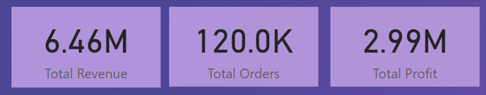

### Task 6.2: Add a Revenue Trending Line Chart

As with the previous task, a trending line chart is copied from **Customer Detail** report page and pasted into **Executive Summary** report page for quickness. In the **Build a Visual** pane x-axis is set to Date Hierarchy which displays only the *Start of Year*, *Start of Quarter* and *Start of Month* while y-axis is set to *Total Revenue* measure. A **Zoom slider** is added on the x-axis so that the user be able to adjust the timeline as needed. 

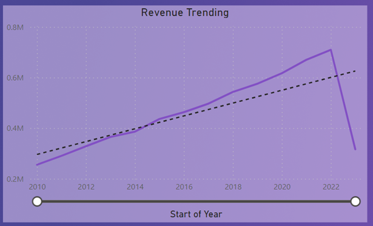

### Task 6.3: Add Donut Charts for Revenue by Country and Store Type

Two donut charts are created to visualise the total revenue by country and store type. 
 
To visualise the revenue by country, the **Legend** option was set as stores[Country Code] column and the **Values** option was set as *Total Revenue* measure. To visualise the revenue by store type, the **Legend** was set as stores[Store Type] column and the **Values** was set as [Total Revenues] measure.

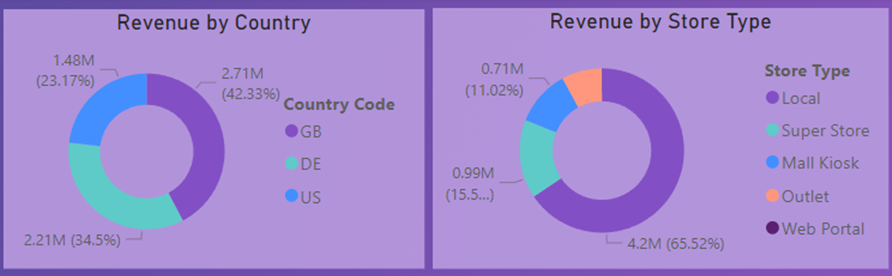

### Task 6.4: Add a Bar Chart of Orders by Product Category

Once again for quickness, a bar chart from **Customer Detail** report page is copied and then pasted into **Executive Summary** report page. In the on-object **Build a visual** pane, the visual type is changed to Clustered bar chart as well as x-axis is changed from *Total Customers* to *Total Orders* measure (*Category* measure on y-axis is left the same). Finally, from the on-object **Format** pane, **Date Labels** option is turned on. 

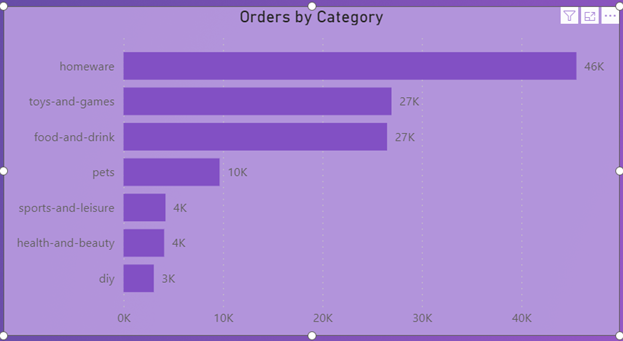

### Task 6.5: Add KPI visuals

Before even creating KPI or a.k.a Key Performance Indicator visuals, a set of new measures need to be created which will be used in the visuals (see DAX formulas below):
 - Previous Quarter Profit: &emsp;&emsp;&emsp;**Previous Quarter Profit = CALCULATE([Total Profit], PREVIOUSQUARTER(dates[Date]))**
 - Previous Quarter Revenue: &ensp;&emsp;**Previous Quarter Revenue = CALCULATE([Total Revenue], PREVIOUSQUARTER(dates[Date]))**
 - Previous Quarter Orders:&ensp;&ensp;&emsp;&ensp;**Previous Quarter Orders = CALCULATE([Total Orders], PREVIOUSQUARTER(dates[Date]))**
 - Target Profit: &ensp;&ensp;&ensp;&ensp;&ensp;&ensp;&ensp;&emsp;&emsp;&emsp;&emsp;**Target Profit = [Previous Quarter Profit] * 1.05**
 - Target Revenue:&ensp;&ensp;&ensp;&emsp;&emsp;&emsp;&emsp;&emsp;**Target Revenue = [Previous Quarter Revenue] * 1.05**
 - Target Orders: &emsp;&emsp;&emsp;&emsp;&emsp;&emsp;&emsp;**Target Orders = [Previous Quarter Orders] * 1.05**</ul>
 
A new KPI visual is selected created for the revenue. In the on-object **Build a visual** pane, **Value** is set as *Total Revenue* measure, **Trend axis** as *dates[Start of Quarter]* column and **Target** as *Target Revenue* measure. In the **Format** pane, **Trend of axis** is turned on the values are set so that **Direction** is set to *High is Good*, **Bad colour** is set to red colour and **Transparency** is set to 15%. Then the **Callout value** option in the **Format** pane is set to show the KPI value up to 1 decimal place. This creates a KPI for revenue visual that shows the quarterly revenue against the target quarterly revenue. 
 
 
The KPI for revenue visual is then duplicated twice and adjusted in order to display KPI visuals for profit and orders.
 
 
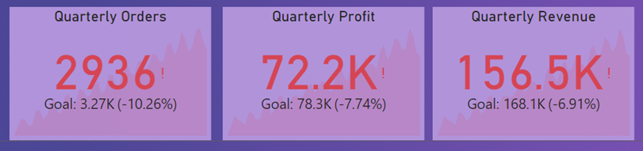
 
 
The completed **Executive Summary** report page can be seen below:
 
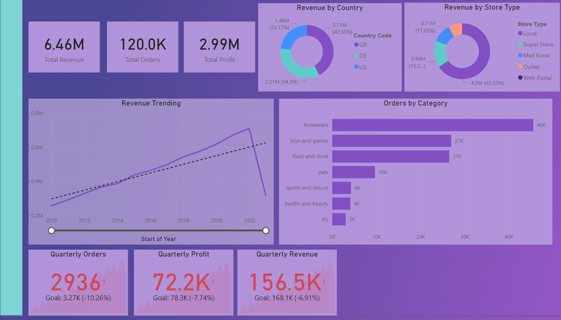

## Milestone 7: Create a Product Detail Page

In this milestone the Product Detail Page of the report will be set up in order to provide an in-depth look at which products are performing well, with the option to filter by product category and country. 
  The report page will contain:
 - Set of three gauge visuals showing the current-quarter performance of Orders, Revenue and Profit against a quarterly target.
 - Card visuals that shows which filters are selected.
 - An area chart showing relative revenue performance of each category over time. 
 - A table showing top 10 of products by revenue.
 - A scatter graph of quantity ordered against profit per order item, filtered by product category. </ul>

### Task 7.1: Add Gauge Visuals

In order to create a set of three gauges showing the current-quarter performance of **Orders**, **Revenue** and **Profit** against a quarterly target (which in this case is 10% quarter-on-quarter growth in all three metrics), six DAX measures had to be created:
 - Current Quarter Orders: &emsp;&emsp;&emsp;&emsp;**Current Quarter Orders = CALCULATE([Total Orders], QUARTER(dates[Date]))**
 - Current Quarter Revenue:&ensp;&ensp;&ensp;&emsp;&emsp;**Current Quarter Revenue = CALCULATE([Total Revenue], QUARTER(dates[Date]))**
 - Current Quarter Profit: &ensp;&emsp;&emsp;&emsp;&emsp;**Current Quarter Profit = CALCULATE([Total Profit], QUARTER(dates[Date]))**
 - 10% Target Orders: &emsp;&emsp;&emsp;&emsp;&emsp;&emsp;**10% Target Orders = [Current Quarter Orders] * 1.10**
 - 10% Target Revenue:&ensp;&ensp;&ensp;&emsp;&emsp;&emsp;&emsp;**10% Target Revenue = [Current Quarter Revenue] * 1.10**
 - 10% Target Profit:&ensp;&ensp;&emsp;&emsp;&emsp;&emsp;&emsp;&emsp;**10% Target Profit = [Current Quarter Profit] * 1.10** </ul>

For each gauge, the maximum value is set to the target (in the **Build a visual** pane, *Current Quarter Orders/Revenue/Profit* is added to the **Value** section and *10% Target Orders/Revenue/Profit* is added to the **Maximum Value** section respectively), so that each gauge shows as full when the target is met.
 
 
Afterwards, Conditional Formatting is applied to the **Callout Value** (the number in the middle of each gauge) so that it shows as red if the target is not yet met. This is done by creating rules via the **Format** pane> **Callout Value > Values: Colours**

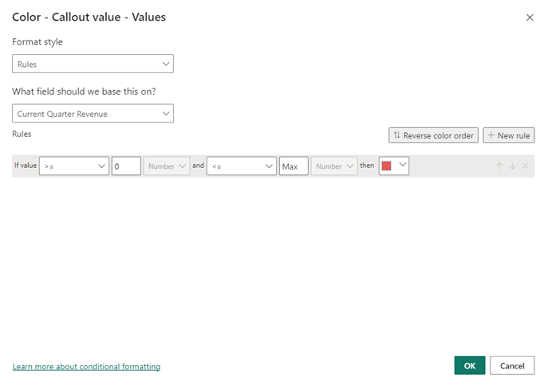

See the finished gauge visuals below:

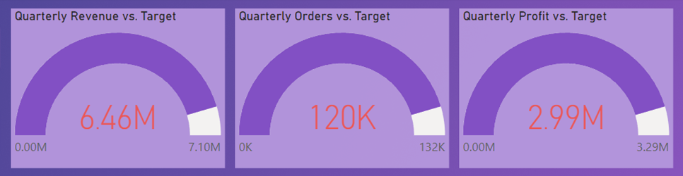

### Task 7.2: Plan Out the Filter State Cards

Two rectangular shapes and two cards are created in the left corner of the **Product Detail** report page. Each shape is grouped up in the **Selection** pane with a card which forms two groups (Group 1 and Group 2) while in both groups having the card visual being at the top of the list. 
 
 
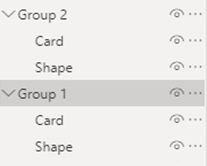
 
 
In each card's settings (located at the **Format** pane) the background is turned off in order for the shapes to represent the background of the cards. 
 
 
Before adding any values to the cards, two new measures are created:
 - Category Selection:  **IF(ISFILTERED(Products[Category]), SELECTEDVALUE((Products[Category]), "No Selection"),"No Selection")**
 - Country Selection:  **Country Selection = IF(ISFILTERED(Stores[Country]), SELECTEDVALUE((Stores[Country]), "No Selection"),"No Selection")** </ul>

These two measures are then added to each of the blank cards. This allows each of the cards to portray the name of the category or country when selected by the user. However if nothing is selected by the user, the cards will simply show "No Selection" sign. 
 
 
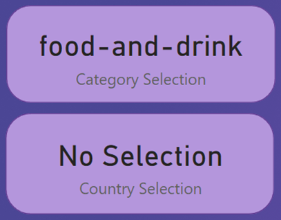

### Task 7.3: Add an Area Chart of Revenue by Product Category

For this task an area chart is created in order to show how the different product categories are performing in terms of revenue over time. In the new chart, the dates[Start of the Quarter] date hierarchy is added on the x-axis with the ability for the user to drill down the information from *Start of Quarter* up to the *Day*, *Total Revenue* measure added on the y-axis and products[Category] columns values are added to the Legend.

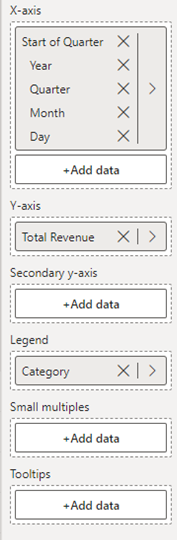

See the completed area chart visual below:

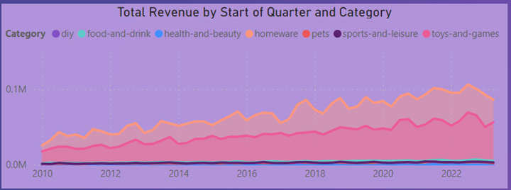

### Task 7.4: Add a Top Products Table

In order to see which products generate most revenue, a table is created to portray the top 10 products by total revenue. 
 
 
The table contains the following fields:
 - products[Description] column values, renamed for the visual as "Top 10 Products".
 - products[Category] column values
 - Total Revenue measure, which has **TopN filter** applied to show top 10 items as well as conditional formatting applied to show data bars for total revenue values.
 - Total Customers measure
 - Total Orders measure
 - Profit per Order measure </ul>
 
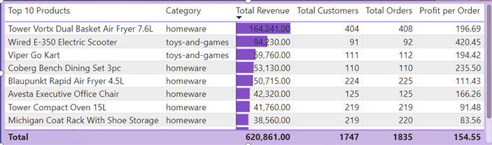

### Task 7.5: Add a Scatter Graph of Quantity Sold vs Profit per Item

Scenario: *The products team want to know which items to suggest to the marketing team for a promotional campaign. They want a visual that allows them to quickly see which product ranges are both top-selling items and also profitable.* To complete this task a scatter graph was chosen to illustrate this. 
 
 
Firstly, a calculated column called *Profit per Item* was created in the *products* table using the DAX formula: 
 **Profit per Item = products[Sale Price] - products[Cost Price]**
 
 
Then the newly added Scatter graph is configured in a way below:
 - **Values**: products[Description]
 - **X-axis**: products[Profit per Item]
 - **Y-axis**: orders[Total Quantity]
 - **Legend**: products[Category] </ul>
 

### Task 7.6: Create a Slicer Toolbar

The aim of this task is to create a pop-out toolbar containing two slicers which can be accessed from the navigation bar on the left-hand side of the report page. 
 
 
To start with, a set of custom navigation bar icons were downloaded from a given link. Then a new blank button was added to the top of the navigation bar, the icon type is set to *Custom* in the **Format** pane, and Filter_icon.png icon image was chosen for the button. Also the *tooltip text* was set to "Open Slicer Panel".

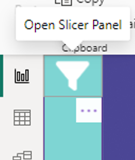
 

Then a new rectangle shape (with same height as the page and 3-5x the width of the navigation bar) in the same turquoise colour as the navigation bar was added. On the **Selection** pane, the newly created shape is brought to the top of the stacking order. This will be our slicer toolbar shape.

Afterwards, two new slicers are created. One for product's category selection (products[Category] is added to the **Field** section) and one for selection of a country (stores[Country] is added to the **Field** section). The titles for the slices are changed to "Product Category" and "Country" respectively. The slicers were edited in a way that both would be in **Vertical List** slicer style, user can select multiple items in *Product Category* slicer, but only one option at the time for *Country* slicer and adding **Select All** option to **Country** slicer so that the user can select all the countries if he/she does not wish to filter the data by country. Both slicers are then placed on top of the slicer toolbar shape with background colour removed (so that the slicer toolbar shape colour would fill the slicers).

A back button is added (**Insert** on the ribbon > **Buttons** > **Back**) on top corner of the slicer toolbar shape. This button will allow us to hide the slicer toolbar when it is not in use. 

Now in the **Selection** pane, we group the slicer toolbar shape, two slicers and a back button into one group (Group 3) and once again we make sure it is at the top of the stacking order. 

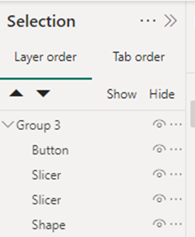

See the complete slicer toolbar below:

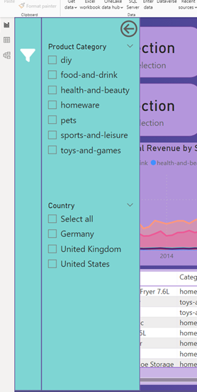

To add bookmarks, we need to open **Bookmarks** pane and add two bookmarks: one called "Slicer Bar Closed" and the other one called "Slicer Bar Open". The idea is that the "Slicer Bar Closed" bookmark will have the slicer bar hidden while the "Slicer Bar Open" bookmark will have the slicer bar visible. When right-clicking each bookmark, it is set so that **Display**, **Current Page** and **All visuals** options are all ticked while the rest of the categories are unchecked (it is essential not to leave **Data** option ticked as this will prevent the bookmark from altering the slicer state when we open or close the slicer toolbar). 

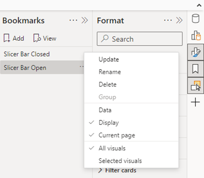

Finally, we assign actions to our "Open Slicer Panel" and "Back" buttons. We can do that by individually selecting each button and then in **Format button** pane and turning the **Action** option on. For the "Back" button we select **Action type** as "Bookmark" and **Action Bookmark** as "Slicer Bar Closed" while for the "Open Slicer Panel" button we select **Action type** as "Bookmark" and **Action Bookmark** as "Slicer Bar Closed.

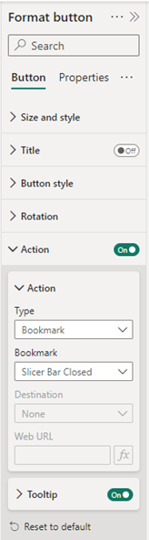 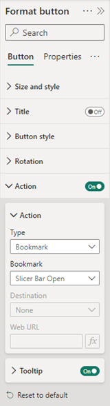

Now we can test the buttons and slicers work (to test the buttons we need to use Ctrl-Click while designing the report in Power BI Desktop).

See the complete **Product Detail** report page below:

